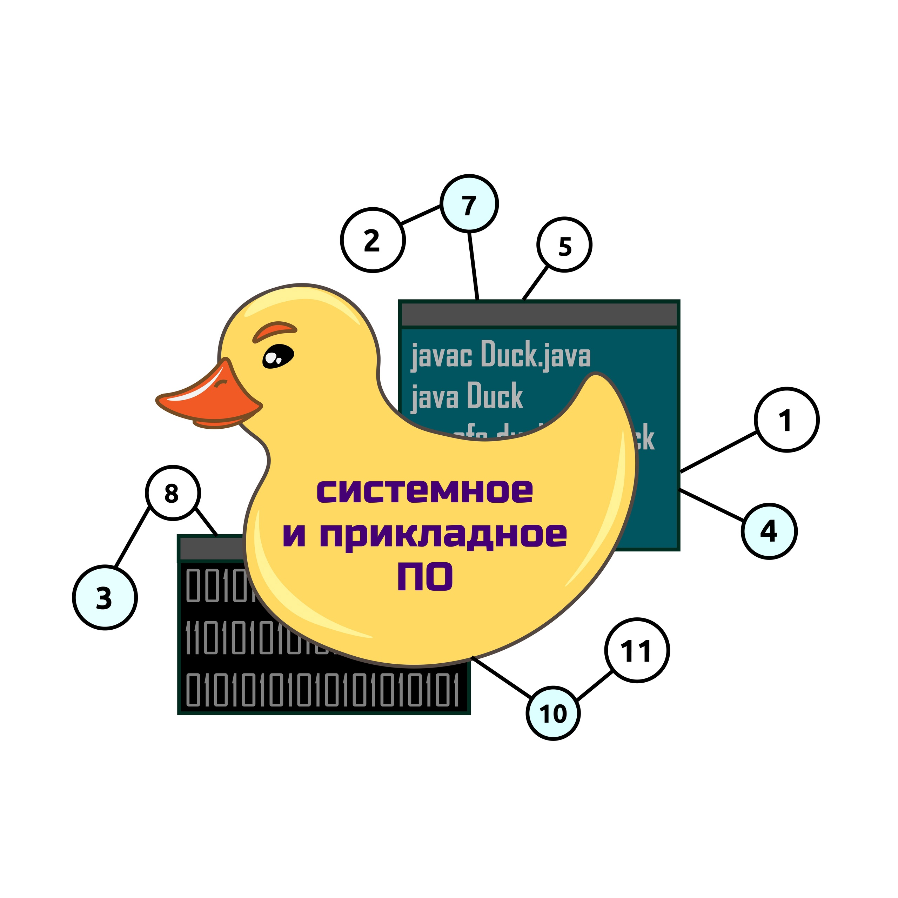

[//]: # ([Link to another page]&#40;./another-page.html&#41;.)
[Учебный план](./sppo.pdf)

# Блок "Программные системы"
## Архитектура программного обеспечения
### Лектор - доцент, к.т.н. Перл Иван Андреевич
Разработка современного программного обеспечения — это сложный и высокотехнологичный процесс. Любая возникающая проблема, с которой сталкиваются инженеры — имеет большое количество разнообразных решений. Дисциплина АПО рассматривает различные сопосбы проектирования программных систем, анализирует их достоинства и недостатки  учит определять какие подходы и шаблоны и в каких случаях могут показать наилучшие результаты при разработке широкого спектра современных программных систем.

# Блок "Компьютерная визуализация"
## Теоретические основы компьютерной графики и вычислительной оптики
### Лектор - доцент, к.ф-т.н. Жданов Дмитрий Дмитриевич

Дисциплина дает представление о базовых методах реалистичной трехмерной компьютерной графики, о том, как построить компьютерные модели объектов трехмерной сцены и отобразить их на экране дисплея так, чтобы человеческий глаз воспринимал это изображение как реальное. В качестве основных решений компьютерной графики рассматриваются растровая и лучевая графики, изучаются их преимущества и недостатки. Понимание основ компьютерной графики требует также изучения базовых принципов вычислительной оптики (для понимания, как фотографическая система формирует изображение), радиометрии (для понимания, что есть свет и как этот свет формирует яркость сцены, видимую глазом), фотометрии (для понимания, как человеческий глаз воспринимает свет) и колориметрии (для понимания, как сформировать RGB изображение и отобразить его на экране наиболее естественным образом). Основы всех этих дисциплин будут рассмотрены на данном курсе. Более глубокое изучение отведено методам лучевой компьютерной графики: будут рассмотрены методы построения геометрических объектов сцены, методы трассировки лучей, методы описания оптических свойств геометрических объектов сцены и взаимодействия света с этими геометрическими объектами.

# Блок "Компьютерное моделирование"
## Математические модели и методология компьютерного моделирования
### Лектор - доцент, к.т.н. Перл Иван Андреевич

Наш мир — очень сложен, и это для нас, живущих внём. Для создаваемых нами машин и систем он оказывается значительно более сложным, так как им приходится иметь дело с тем, к чему мы привыкли с детства и воспринимаем как само собой разумеющееся. Моделирование — это один из наиболее эффективных способов описания того, что нас окружает, того, что есть в наших мыслях и того чего нет и никогда и ни где не будет. В рамках этой дисциплины мы будем говорить о том какие способы, подходы и инструменты есть для моделирования самых разных реальных и виртуальных сущностей. О том хороша или плоха та или иная модель, какую пользу мы можем получить с помощью неё. Мы попробуем разораться в том что такое язык моделирования и какую историю мы сможем рассказать используя его.

# Блок "Пользовательские интерфейсы"
## Проектирование и прототипирование пользовательских интерфейсов
### Лектор - преподаватель, Саркисова Илона Рафаэловна

Проектирование и прототипирование пользовательских интерфейсов: студенты пройдут полный цикл проектирования пользовательских интерфейсов от исследования и постановки проблемы до подготовки финальных дизайн-макетов к передаче в разработку. Курс позволяет овладеть ключевыми навыками UX/UI-дизайнера, благодаря которым студенты повышают свои шансы на трудоустройство и успешную работу по специальности.

# Блок "Искусственный интеллект"
## Методология инженерии программных систем ИИ
### Лектор - Старобыховская Анастасия Александровна

Для индустриальной разработки программных систем искусственного интеллекта необходимо владеть вопросами организации процесса. Данный курс рассматривает все аспекты методологии инженерии программных систем ИИ - от жизненного цикла и моделей разработки (водопадная, каскадная, Agile-методология) программных систем до новых, специфических для области ИИ технологий MLOps, AutoML, DevOps.

# Блок "IT-индустрия"
## Java-разработка
### Лектор - компания Tune IT

Пока в процессе: [Java SE: Programming II](https://www.tune-it.ru/education/catalogue/-/catalogue/vendors/Oracle/Java/OJ11P2) или [Java SE 11: Programming Complete](https://www.tune-it.ru/education/catalogue/-/catalogue/vendors/Oracle/Java/OJPC).

